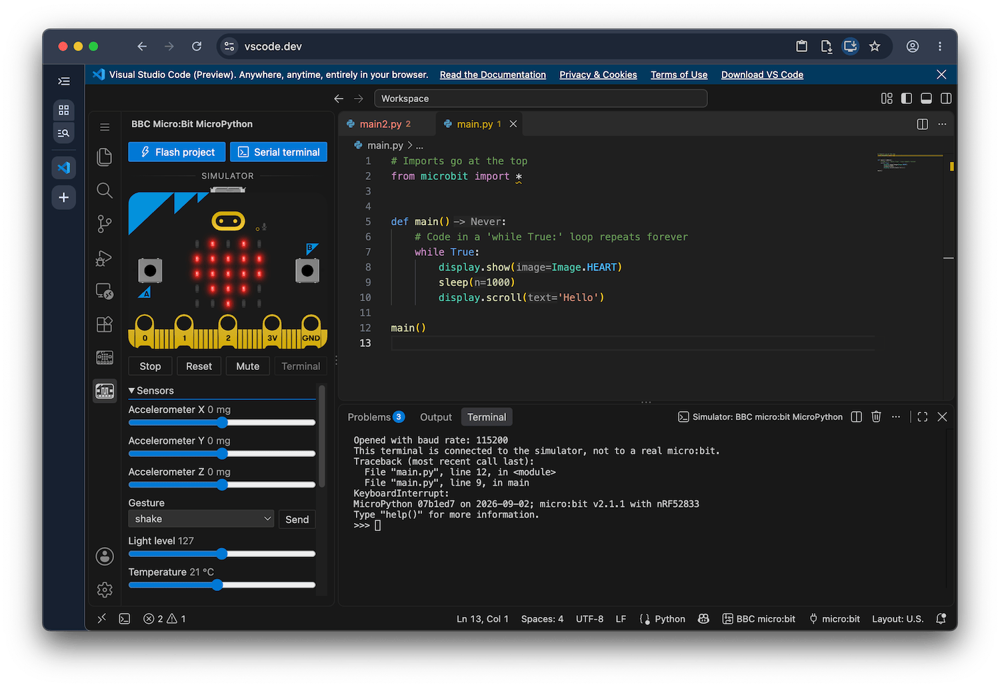

# BBC micro:bit MicroPython

Build and flash a MicroPython project to a BBC micro:bit, connect to the device
serial and REPL, or run your code in the built-in simulator 🐍🤖.

Works on both desktop and web versions of VS Code and compatible editors.

🚧 Extension still under construction. Most features are implemented and should
be usable, if you find any issues please raise a bug, it'll be very appreciated!
https://github.com/carlosperate/vscode-microbit-micropython/issues

## How to use it

1. Write your code in `main.py` (or any file in your project folder).
2. Click the micro:bit icon in the activity bar on the side and press play on
  the board there, your code will run on the simulator.
3. To run it on a real board, plug in your micro:bit with a USB cable.
4. Click the **Flash** button.
5. Using non-Chromium browsers? Click on the micro:bit icon in the status bar
  at the bottom and choose **Save Hex** instead, then drag the saved
  file onto the `MICROBIT` drive that appears when you plug in the board.
6. To talk to the board, choose **Open Serial Terminal** from the same menu or
  the activity bar on the sidebar.
  Press `Ctrl+C` to interrupt the running program and get a MicroPython prompt.

  

## What it does

- **Run in Simulator:** Run your project on a simulated micro:bit in the side
  bar.
- **Direct Flash:** Send the built MicroPython hex to a connected micro:bit.
  In a Chromium based browser this goes over WebUSB, in desktop VS Code it uses
  the `MICROBIT` USB drive.
- **Open Serial Terminal:** And access the MicroPython REPL from the board,
  inside a VS Code's terminal.
- **Save Hex:** Builds a hex from your workspace and MicroPython, the same way
  the micro:bit's online Python editor does, and saves it. You can copy this
  file onto the `MICROBIT` drive to run your code.

## Your project folder

Every file in your micro:bit project folder goes on the board, not only
`main.py` and not only `.py` files. The default exceptions are: files inside
folders, dot files, and `.hex` files.
The micro:bit internal filesystem is flat, so it cannot contain folders.

The project folder is the whole workspace by default. If your code lives in a
subfolder, run the **Select Project Folder** command to select it.

## What works where

| | Simulator | Flash | Serial REPL | Save Hex |
|---|---|---|---|---|
| Desktop VS Code | ✅ | ✅ copies to the `MICROBIT` drive | ✅ native serial port | ✅ |
| Chrome, Edge and other Chromium browsers | ✅ | ✅ WebUSB | ✅ WebUSB | ✅ |
| Firefox 151+ (desktop) | ✅ | ❌ no WebUSB, use Save Hex | ❓ Web Serial (theoretically, known issue present) | ✅ |
| Safari | ✅ | ❌ no WebUSB, use Save Hex | ❌ no WebUSB or Web Serial | ✅ |

The simulator is the one column that is a tick everywhere: it needs no board, no
cable and no browser device API, only WebAssembly.

## Requirements

- VS Code desktop, or if used in the browser, a Chromium-based browser for
  WebUSB flashing and Serial Terminal.
    - Firefox also supports the Serial Terminal, using Web Serial instead.
    - Desktop VS Code needs no WebUSB: it copies to the `MICROBIT` drive.
- The [Eclipse Serial Monitor extension](https://marketplace.visualstudio.com/items?itemName=eclipse-cdt.serial-monitor)
  is installed automatically with this extension, used to open a serial
  terminal.
- The [MicroPython & CircuitPython IntelliSense extension](https://marketplace.visualstudio.com/items?itemName=carlosperate.micropython-lsp)
  is installed automatically for autocomplete, type checking, and inline
  documentation.

## Licence

MIT, see [LICENSE](LICENSE).

The bundled MicroPython firmware images come from
[bbcmicrobit/micropython](https://github.com/bbcmicrobit/micropython) (V1) and
[microbit-foundation/micropython-microbit-v2](https://github.com/microbit-foundation/micropython-microbit-v2)
(V2), both MIT licensed.

The MicroPython logo used in the extension icon comes from the
[MicroPython project](https://github.com/micropython/micropython) under the
MIT License.

The micro:bit simulator is built from
[micropython-microbit-v2-simulator](https://github.com/microbit-foundation/micropython-microbit-v2-simulator),
under the MIT License.
